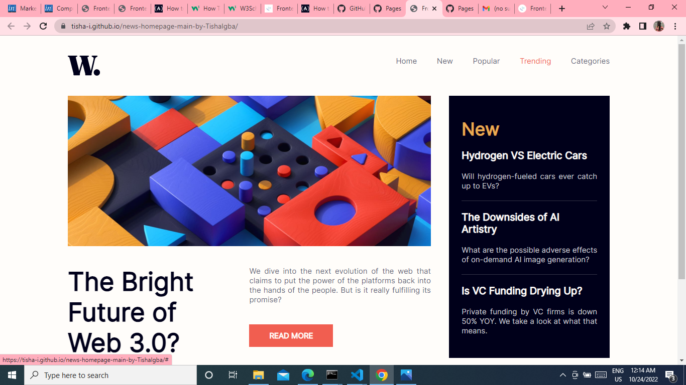
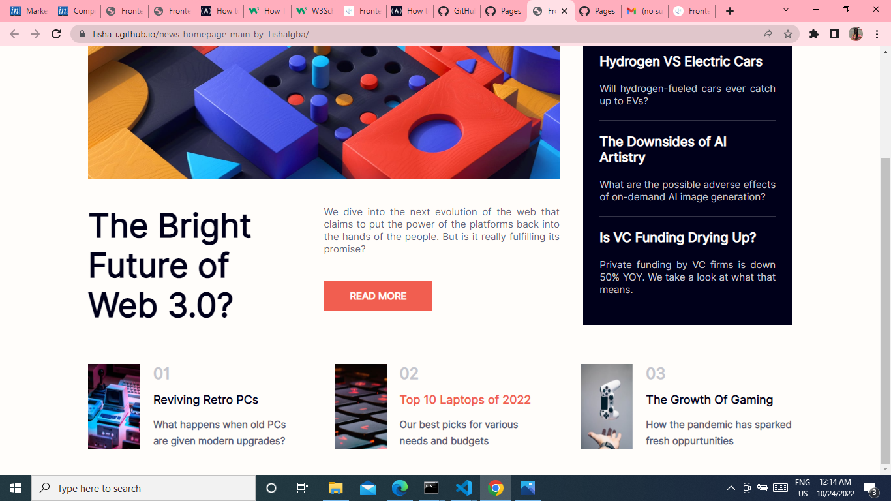
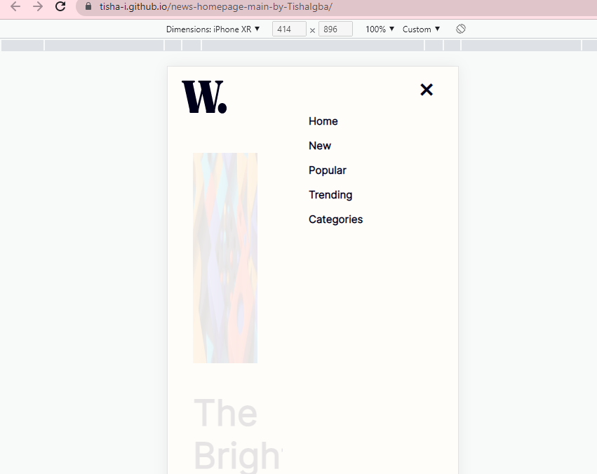
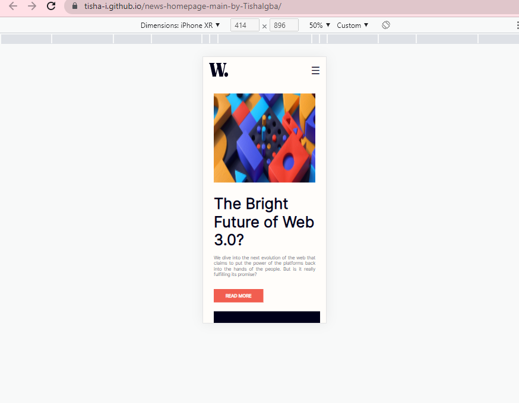

# Frontend Mentor - News homepage solution

This is a solution to the [News homepage challenge on Frontend Mentor](https://www.frontendmentor.io/challenges/news-homepage-H6SWTa1MFl). Frontend Mentor challenges help you improve your coding skills by building realistic projects. 

## Table of contents

- [Overview](#overview)
  - [The challenge](#the-challenge)
  - [Screenshot](#screenshot)
  - [Links](#links)
- [My process](#my-process)
  - [Built with](#built-with)
  - [What I learned](#what-i-learned)
  - [Continued development](#continued-development)
- [Author](#author)
## Overview

### The challenge

Users should be able to:

- View the optimal layout for the interface depending on their device's screen size
- See hover and focus states for all interactive elements on the page
- **Bonus**: Toggle the mobile menu (requires some JavaScript)

### Screenshot






    
### Links

- Solution URL: (https://tisha-i.github.io/news-homepage-main-by-TishaIgba/)
- Live Site URL: (https://tisha-i.github.io/news-homepage-main-by-TishaIgba/)

## My process

### Built with

- CSS
- HTML
- JS

### What I learned
```js
function openNav() {
    document.getElementById("mySidebar").style.width = "250px";
    document.getElementById("main").style.marginRight = "250px";
    document.getElementById("main").style.opacity = "0.1";
  }
  
  function closeNav() {
    document.getElementById("mySidebar").style.width = "0";
    document.getElementById("main").style.marginRight= "0";
    document.getElementById("main").style.opacity = "1";
  }
```
## Author

- Frontend Mentor - [@tisha-i](https://www.frontendmentor.io/profile/tisha-i)
- Instagram - [@l.e.t.i.s.h.a](https://www.instagram.com/l.e.t.i.s.h.a)

**Note: Delete this note and add/remove/edit lines above based on what links you'd like to share.**

## Acknowledgments

This is where you can give a hat tip to anyone who helped you out on this project. Perhaps you worked in a team or got some inspiration from someone else's solution. This is the perfect place to give them some credit.

**Note: Delete this note and edit this section's content as necessary. If you completed this challenge by yourself, feel free to delete this section entirely.**
